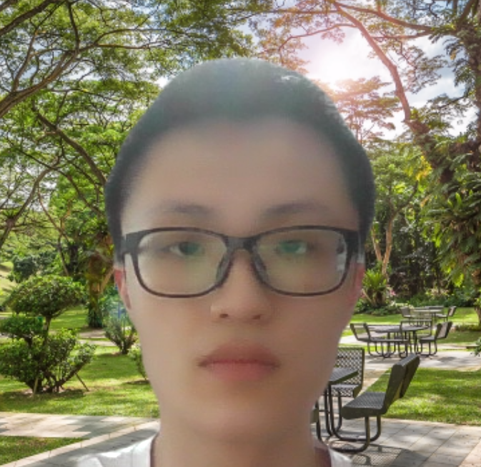
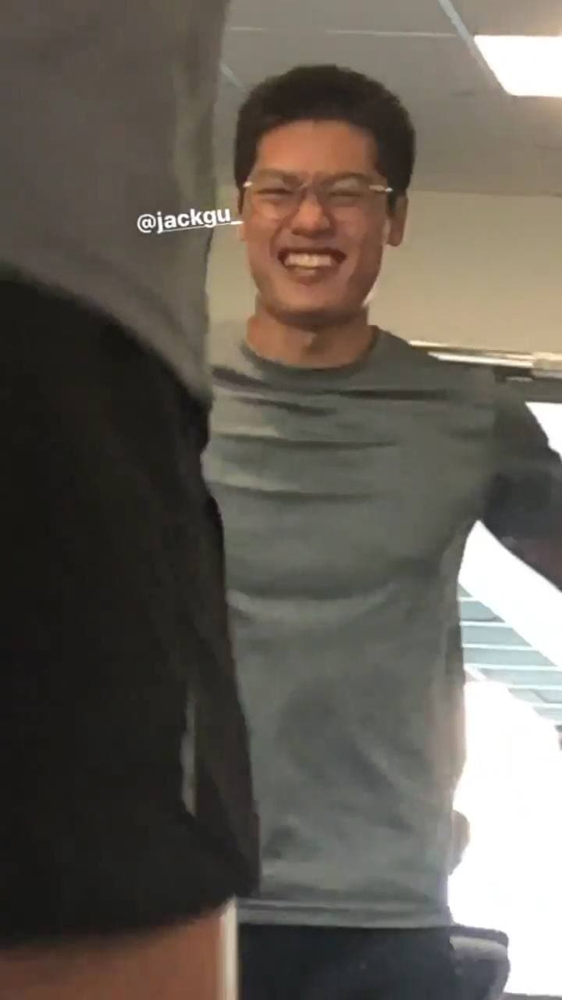
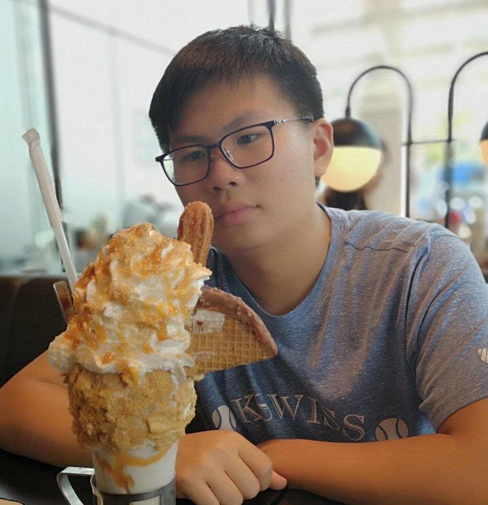
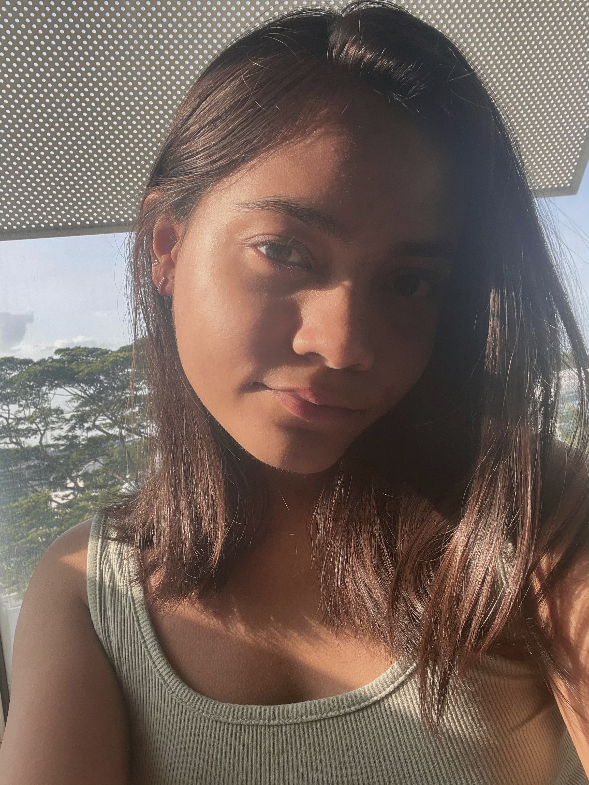
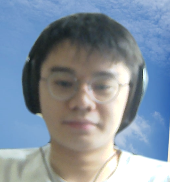

We are a team based in the [School of Computing, National University of Singapore](http://www.comp.nus.edu.sg).

## Project team

### Chang Chuan Hao

[[github](https://github.com/Chang-CH)]
[[portfolio](team/chang-ch.md)]

* Role: Team lead
* Responsibilities: Responsible for overall project coordination.
* Features: Edit ALL, UI

### Gu Geng

[[github](https://github.com/jackgugz)]
[[portfolio](team/jackgugz.md)]

* Role: Code quality
* Responsibilities: Looks after code quality, ensures adherence to coding standards, etc.
* Features: Filter feature

### Jerome Soh

[[github](http://github.com/Jeromesyl)]
[[portfolio](team/jeromesyl.md)]

* Role: Scheduling and tracking
* Responsibilities: : In charge of defining, assigning, and tracking project tasks.
* Features: Undo/Redo features

### Nicole Joseph

[[github](http://github.com/nicolej2122)]
[[portfolio](team/nicolej2122.md)]

* Role: Testing
* Responsibilities: Ensures the testing of the project is done properly and on time.
* Features: View feature

### Xiao Yunpeng

[[github](http://github.com/yunpeng1234)]
[[portfolio](team/yunpeng1234.md)]

* Role: Integration
* Responsibilities: In charge of versioning of the code, maintaining the code repository, integrating various parts of the software to create a whole.
* Features: UI, Delete ALL
