* Table of Contents
{:toc}

--------------------------------------------------------------------------------------------------------------------

## **Acknowledgements**

* Libraries used: [JavaFX](https://openjfx.io/), [Jackson](https://github.com/FasterXML/jackson), [JUnit5](https://github.com/junit-team/junit5) 

--------------------------------------------------------------------------------------------------------------------

## **Setting up, getting started**

Refer to the guide [_Setting up and getting started_](SettingUp.md).

--------------------------------------------------------------------------------------------------------------------

## **Design**

### Architecture

The ***Architecture Diagram*** given above explains the high-level design of the App.

Given below is a quick overview of main components and how they interact with each other.

**Main components of the architecture**

**`Main`** has two classes called [`Main`](https://github.com/AY2122S1-CS2103T-F12-2/tp/blob/master/src/main/java/seedu/intern/Main.java) and [`MainApp`](https://github.com/AY2122S1-CS2103T-F12-2/tp/blob/master/src/main/java/seedu/intern/MainApp.java). It is responsible for,
* At app launch: Initializes the components in the correct sequence, and connects them up with each other.
* At shut down: Shuts down the components and invokes cleanup methods where necessary.

[**`Commons`**](#common-classes) represents a collection of classes used by multiple other components.

The rest of the App consists of four components.

* [**`UI`**](#ui-component): The UI of the App.
* [**`Logic`**](#logic-component): The command executor.
* [**`Model`**](#model-component): Holds the data of the App in memory.
* [**`Storage`**](#storage-component): Reads data from, and writes data to, the hard disk.

**How the architecture components interact with each other**

The *Sequence Diagram* below shows how the components interact with each other for the scenario where the user issues the command `delete 1`.

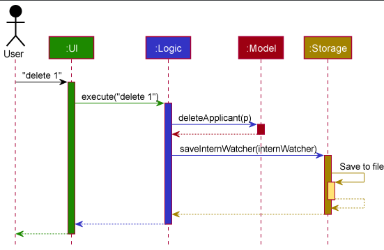

Each of the four main components (also shown in the diagram above),

* defines its *API* in an `interface` with the same name as the Component.
* implements its functionality using a concrete `{Component Name}Manager` class (which follows the corresponding API `interface` mentioned in the previous point.

For example, the `Logic` component defines its API in the `Logic.java` interface and implements its functionality using the `LogicManager.java` class which follows the `Logic` interface. Other components interact with a given component through its interface rather than the concrete class (reason: to prevent outside component's being coupled to the implementation of a component), as illustrated in the (partial) class diagram below.

The sections below give more details of each component.

### UI component

The **API** of this component is specified in [`Ui.java`](https://github.com/AY2122S1-CS2103T-F12-2/tp/blob/master/src/main/java/seedu/intern/ui/Ui.java)

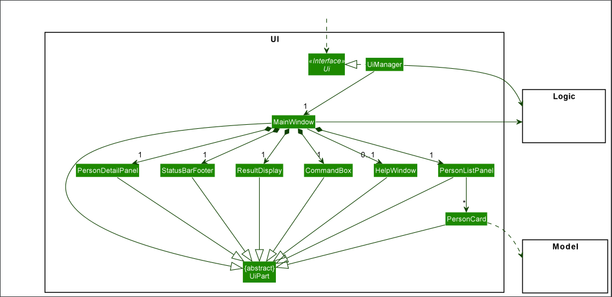

The UI consists of a `MainWindow` that is made up of parts e.g.`CommandBox`, `ResultDisplay`, `ApplicantListPanel`, `StatusBarFooter` etc. All these, including the `MainWindow`, inherit from the abstract `UiPart` class which captures the commonalities between classes that represent parts of the visible GUI.

The `UI` component uses the JavaFx UI framework. The layout of these UI parts are defined in matching `.fxml` files that are in the `src/main/resources/view` folder. For example, the layout of the [`MainWindow`](https://github.com/AY2122S1-CS2103T-F12-2/tp/blob/master/src/main/java/seedu/intern/ui/MainWindow.java) is specified in [`MainWindow.fxml`](https://github.com/AY2122S1-CS2103T-F12-2/tp/blob/master/src/main/resources/view/MainWindow.fxml).

The `UI` component,

* executes user commands using the `Logic` component.
* listens for changes to `Model` data so that the UI can be updated with the modified data.
* keeps a reference to the `Logic` component, because the `UI` relies on the `Logic` to execute commands.
* depends on some classes in the `Model` component, as it displays `Applicant` object residing in the `Model`.

### Logic component

**API** : [`Logic.java`](https://github.com/AY2122S1-CS2103T-F12-2/tp/blob/master/src/main/java/seedu/intern/logic/Logic.java)

Here's a (partial) class diagram of the `Logic` component:

How the `Logic` component works:
1. When `Logic` is called upon to execute a command, it uses the `InternWatcherParser` class to parse the user command.
1. This results in a `Command` object (more precisely, an object of one of its subclasses e.g., `AddCommand`) which is executed by the `LogicManager`.
1. The command can communicate with the `Model` when it is executed (e.g. to add an applicant).
1. The result of the command execution is encapsulated as a `CommandResult` object which is returned from `Logic`.

The Sequence Diagram below illustrates the interactions within the `Logic` component for the `execute("delete 1")` API call.

:information_source: **Note:** The lifeline for `DeleteCommandParser` should end at the destroy marker (X) but due to a limitation of PlantUML, the lifeline reaches the end of diagram.

Here are the other classes in `Logic` (omitted from the class diagram above) that are used for parsing a user command:

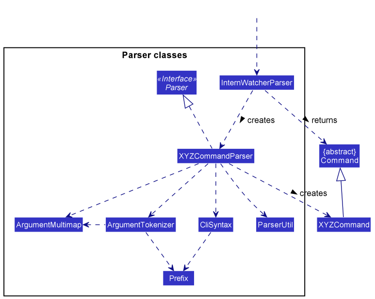

How the parsing works:
* When called upon to parse a user command, the `InternWatcherParser` class creates an `XYZCommandParser` (`XYZ` is a placeholder for the specific command name e.g., `AddCommandParser`) which uses the other classes shown above to parse the user command and create a `XYZCommand` object (e.g., `AddCommand`) which the `InternWatcherParser` returns a `Command` object.
* All `XYZCommandParser` classes (e.g., `AddCommandParser`, `DeleteCommandParser`, ...) inherit from the `Parser` interface so that they can be treated similarly where possible e.g, during testing.

### Model component
**API** : [`Model.java`](https://github.com/AY2122S1-CS2103T-F12-2/tp/blob/master/src/main/java/seedu/intern/model/Model.java)

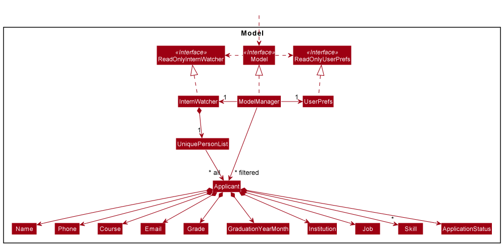

The `Model` component,

* stores the Intern Watcher data i.e., all `Applicant` objects (which are contained in a `UniqueApplicantList` object).
* stores the currently 'selected' `Applicant` objects (e.g., results of a search query) as a separate _filtered_ list which is exposed to outsiders as an unmodifiable `ObservableList<Applicant>` that can be 'observed' e.g. the UI can be bound to this list so that the UI automatically updates when the data in the list change.
* stores a `UserPref` object that represents the user’s preferences. This is exposed to the outside as a `ReadOnlyUserPref` objects.
* does not depend on any of the other three components (as the `Model` represents data entities of the domain, they should make sense on their own without depending on other components)

:information_source: **Note:** An alternative (arguably, a more OOP) model is given below. It has a `Skill` list in the `InternWatcher`, which `Applicant` references. This allows `InternWatcher` to only require one `Skill` object per unique skill, instead of each `Applicant` needing their own `Skill` objects. 

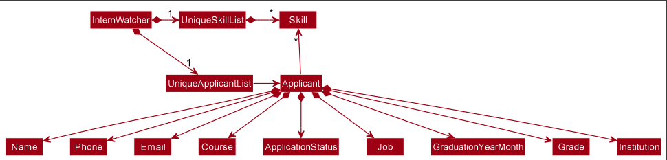

### Storage component

**API** : [`Storage.java`](https://github.com/AY2122S1-CS2103T-F12-2/tp/blob/master/src/main/java/seedu/intern/storage/Storage.java)

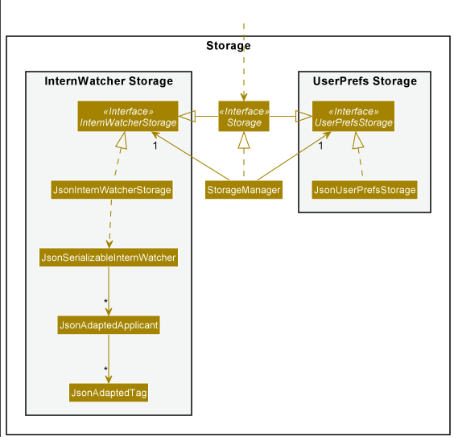

The `Storage` component,
* can save both Intern Watcher data and user preference data in json format, and read them back into corresponding objects.
* inherits from both `InternWatcherStorage` and `UserPrefStorage`, which means it can be treated as either one (if only the functionality of only one is needed).
* depends on some classes in the `Model` component (because the `Storage` component's job is to save/retrieve objects that belong to the `Model`)

### Common classes

Classes used by multiple components are in the `seedu.intern.commons` package.

--------------------------------------------------------------------------------------------------------------------

## **Implementation**

This section describes some noteworthy details and design considerations on how certain features are implemented.

###  Add feature

#### Design considerations:
**Aspect: Prevent duplicate entries**
- **Alternative 1 (current choice)**: Disallow entries with duplicate names in a case-insensitive manner.
    - Pros: Easy to implement
    - Cons: Disallow different people of same name to be added to the app at the same time.
- **Alternative 2**: Create and use another unique field for the applicants and use that for identification.
    - Pros: Allow for multiple entries with the same name.
    - Cons: Harder to implement. Users may abuse the `add` command intentionally and unintentionally. 

Therefore, with the above consideration and the fact that different applicants sharing same name is relatively rare case, we decided to proceed with alternative 1.
 
 
**Aspect: Restriction over graduation year month**
 
As internship has timeliness as its nature and our application development only started in 2021, it would be more reasonable for us to set January 2020 to be the lower bound of accepted graduation year month to give HRs some allowance to keep some previous data. However, anyone who graduated before such said time will not likely be looking for an internship anymore, and therefore should be disallowed in our system.

###  Edit ALL feature

#### Implementation
* The edit ALL mechanism is facilitated by the new `Selection` class. A new parser `ParserUtil#parseSelection`
has been added to parse `Selection` values, which accepts either integers or the `ALL` string. The `Selection` class supports
operations `Selection#hasAllSelectFlag` and `Selection#hasIndex`, which is used by `EditCommand#execute`. 
 
* `EditCommand#execute`
has been modified, such that whenever `Selection#hasAllSelectFlag` returns `true`, `EditCommand#execute` edits all applicants with
the fields specified. 
 
* `Selection` has been given a private constructor with static factory methods `Selection#fromIndex` and
`Selection#fromAllFlag` to ensure `Selection` should not contain both index and all flag.

The following activity diagrams summarizes what happens when a user enters an `edit` command.

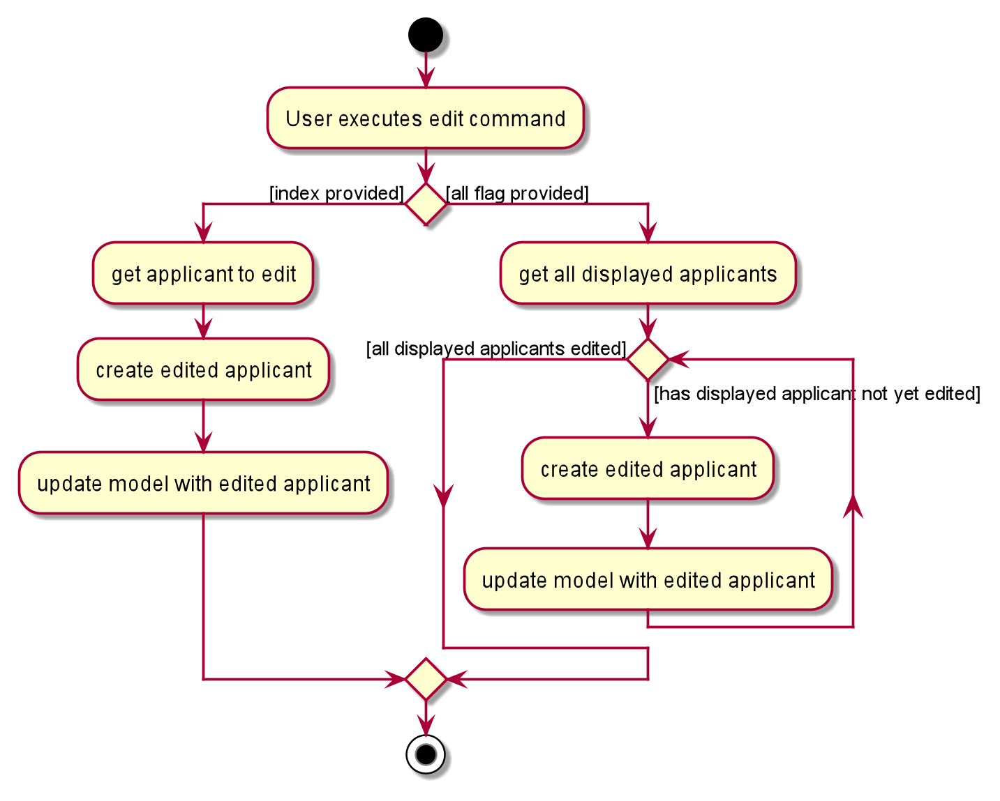

Edit ALL updates the details of all currently displayed applicants by obtaining the list of currently displayed applicants via `Model#getFilteredApplicantList`.
The list is then copied, after which each individual applicant is modified via `Model#setApplicant` in a for loop.

The following sequence diagram summarizes what happens when a user enters an `edit``ALL` command.

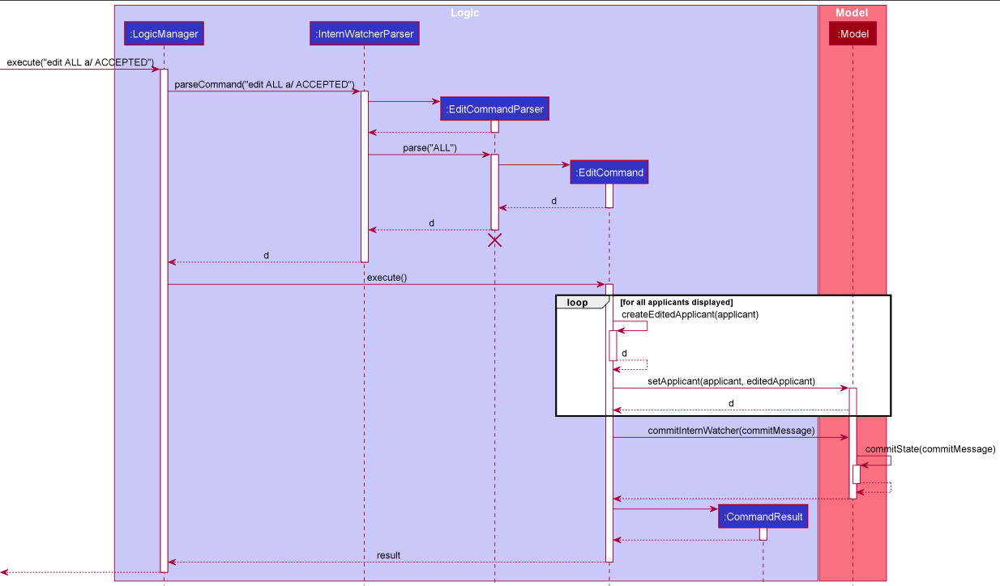

#### Design considerations:
**Aspect: How edit ALL is parsed**
- **Alternative 1 (current choice)**: Modify the parser to parse the `Selection`, accepting a special flag to indicate all applicants
should be edited.
    - Pros: Easy to implement
    - Cons: `EditCommand` and its related parsers may become harder to test since its behaviour is now different depending
    on the user input.
- **Alternative 2**: Create a separate `EditAllCommand` with its own parser.
    - Pros: Easier to test, the behaviour of `EditAllCommand` should not affect `EditCommand`.
    - Cons: Harder to implement. Users might also find editing multiple applicants having a separate command unintuitive.

**Aspect: How edit arguments are stored**
- **Alternative 1 (current choice)**: Create a `Selection` class with private constructor and static factory methods to store either the
  `ALL` flag or the `Index`.
    - Pros: Disallows `ALL` flag to exist together with `Index`, making debugging easier. Keeps modifications to existing classes minimal.
    - Cons: Most `EditCommand` tests would have to be changed to accommodate the new constructor. `Selection`
- **Alternative 2**: Overload `EditCommand` constructor to accept an additional boolean flag.
    - Pros: Easy to implement, existing classes/methods need not be changed.
    - Cons: Additional parser method must be created. Users may unintentionally pass both `ALL` and `Index` to parser.

**Aspect: What fields can edit ALL accept**
- **Alternative 1 (current choice)**: Only allow mass modifications to `ApplicationStatus`.
    - Pros: Users cannot unintentionally modify all applicants' personal details, such as `Name`, `Email`, `Grade`.
      There should not be a reason to mass modify these fields. If a user created a number of applicants with the wrong details
      `UndoCommand` can be used instead.
    - Cons: Usage of `edit ALL` would be limited.
- **Alternative 2**: Allow mass modifications of all fields
    - Pros: `edit ALL` behaviour can be kept similar to `edit INDEX`, increasing usability.
    - Cons: Allows users to unintentionally modify applicant fields that should normally not require mass edits.

###  Delete ALL feature

#### Implementation
* The delete ALL mechanism is facilitated by the new `Selection` class shared with edit ALL. A new parser `ParserUtil#parseSelection`
has been added to parse `Selection` values, which accepts either integers or the `ALL` string. The `Selection` class supports
operations `Selection#hasAllSelectFlag` and `Selection#hasIndex`, which is used by `DeleteCommand#execute`. 
 
* `DeleteCommand#execute`
has been modified, such that whenever `Selection#hasAllSelectFlag` returns `true`, `DeleteCommand#execute` delete all applicants on the displayed list. 
 
* `Selection` has been given a private constructor with static factory methods `Selection#fromIndex` and
`Selection#fromAllFlag` to ensure `Selection` should not contain both index and all flag.

#### Design considerations:
**Aspect: How delete ALL is parsed**
- **Alternative 1 (current choice)**: Modify the parser to parse the `Selection`, accepting a special flag to indicate all applicants
  should be deleted.
    - Pros: Easy to implement, shares the same model with `edit ALL`.
    - Cons: `DeleteCommand` and its related parsers may become harder to test since its behaviour is now different depending
      on the user input.
- **Alternative 2**: Create a special `Index` of -1 when ALL tag is attached, as such, only when the index is -1, will we execute 'delete All'
    - Pros: Easy to implement
    - Cons: Bypasses the intention of the Index Class. Having a negative `Index` might throw unexpected errors.

The following sequence diagram summarizes what happens when a user enters an `delete ALL` command.

    
### Filter feature

#### Implementation

* The filter mechanism is facilitated by `FilterCommandParser`. `FilterCommandParser` produces a `FilterApplicantDescriptor`, which in turn helps to create a `FilterCommand`.
 
* `Optional` and `Set` data structures have been used to contain optional set of filters for different fields within `FilterApplicantDescriptor`.
 
* The `FilterCommand` will make use of the `FilterApplicantDescriptor` to create a `CombineFiltersPredicate` that will be supplied to `ModelManager#updateFilteredApplicantList(Predicate<Applicant>)` in its `execute` method.
 
* `ModelManager` helps filter through the applicant list with specified filter criteria contained and interpreted by the `CombineFiltersPredicate#test()`.

#### Design considerations:
**Aspect: How filter for different fields work**
- **Name, Phone, Email**: These fields are excluded from filter criteria as `filter` is supposed to serve the purpose of selecting potential candidates based on practical considerations other than these three fields.
- **Grade**: HRs should be more interested in finding candidates whose grades meet a certain threshold. Therefore, only applicants that have grades not smaller than the input `Grade` will be displayed.
- **GraduationYearMonth**: HRs should be more interested in finding candidates who graduate before a certain period and who are readily available for deployment before internship starts. Therefore, only applicants that graduate strictly earlier than the input `GraduationYearMonth` will be displayed.
- **Institutions**: HRs should be more open to accept applicants from a collection of institutions. For example, HRs may be interested in finding applicants that are from either NUS or NTU as the company has affiliation programme with the said two institutions. Also, such filters should be case-insensitive as the capitalisation is not meaningful when considering the said fields.
- **Jobs**: HRs should be more interested in filtering applicants for a range of related jobs. For example, HRs may be interested in choosing appropriate applicants for both software engineer and software tester as the requirements for both jobs are similar, and it is easier to look at both at once. Also, such filters should be case-insensitive as the capitalisation is not meaningful when considering the said fields.
- **Skills**: HRs should be more interested to use multiple `Skill` filters to exclusively find applicants that have all skills required in order to perform the applied job. And the filters shall be case-sensitive as capitalisation may differentiate two seemingly same skills.
- **Statues**: HRs should be more interested to only look at certain groups of applicants filtered by a selection of `Status` filters. For example, a HR wishes to delete all applicants to a job except for those "accepted" after the job is filled up. This filter shall be case-sensitive as it is a special tag that has pre-defined elements.
- **Courses**: HRs should be more interested to find applicants from a collection of courses as one same job can be assigned to applicants from similar but different courses. Also, the filter shall be case-insensitive.

### Undo/redo feature

#### Implementation

The undo/redo mechanism is facilitated by `VersionedInternWatcher`. It extends `InternWatcher` with an undo/redo history, stored internally as an `watcherStateList` and `currStatePointer`. Additionally, it implements the following operations:

* `VersionedInternWatcher#commitState()` — Saves the current Intern Watcher state in its history.
* `VersionedInternWatcher#undo()` — Restores the previous Intern Watcher state from its history.
* `VersionedInternWatcher#redo()` — Restores a previously undone Intern Watcher state from its history.

These operations are exposed in the `Model` interface as `Model#commitInternWatcher()`, `Model#undoInternWatcher()` and `Model#redoInternWatcher()` respectively.

Given below is an example usage scenario and how the undo/redo mechanism behaves at each step.

Step 1. The user launches the application for the first time. The `VersionedInternWatcher` will be initialized with the initial Intern Watcher state, and the `currStatePointer` pointing to that single Intern Watcher state.

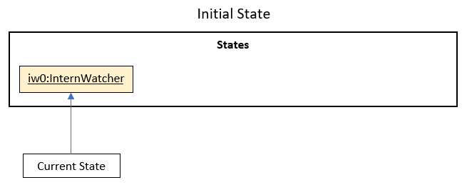

Step 2. The user executes `delete 5` command to delete the 5th applicant in the applicant list . The `delete` command calls `Model#commitInternWatcher()`, causing the modified state of the applicant list after the `delete 5` command executes to be saved in the `watcherStateList`, and the `currStatePointer` is shifted to the newly inserted Intern Watcher state.

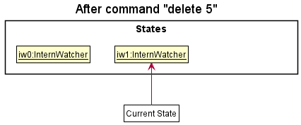

Step 3. The user executes `add n/David …​` to add a new applicant. The `add` command also calls `Model#commitInternWatcher()`, causing another modified Intern Watcher state to be saved into the `watcherStateList`.

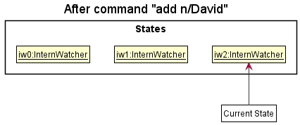

:information_source: **Note:** If a command fails its execution, it will not call `Model#commitInternWatcher()`, so the Intern Watcher state will not be saved into the `watcherStateList`.

Step 4. The user now decides that adding the applicant was a mistake, and decides to undo that action by executing the `undo` command. The `undo` command will call `Model#undoInternWatcher()`, which will shift the `currStatePointer` once to the left, pointing it to the previous state, and restores the applicant list to that state.

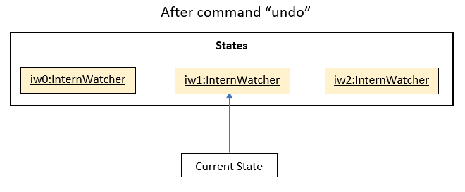

:information_source: **Note:** If the `currStatePointer` is at index 0, pointing to the initial Intern Watcher state, then there are no previous Intern Watcher states to restore. The `undo` command uses `Model#canUndoInternWatcher()` to check if this is the case. If so, it will return an error to the user rather
than attempting to perform the undo.

The following sequence diagram shows how the undo operation works:

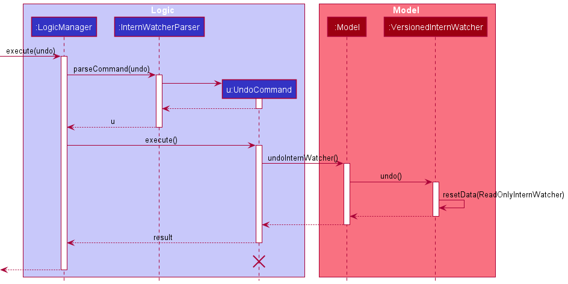

:information_source: **Note:** The lifeline for `UndoCommand` should end at the destroy marker (X) but due to a limitation of PlantUML, the lifeline reaches the end of diagram.

The `redo` command does the opposite — it calls `Model#redoInternWatcher()`, which shifts the `currStatePointer` once to the right, pointing to the previously undone state, and restores the applicant list to that state.

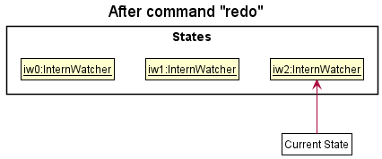

:information_source: **Note:** If the `currStatePointer` is at index `watcherStateList.size() - 1`, pointing to the latest Intern Watcher state, then there are no undone Intern Watcher states to restore. The `redo` command uses `Model#canRedoInternWatcher()` to check if this is the case. If so, it will return an error to the user rather than attempting to perform the redo.

Step 5. Let's say that the user goes through with the Undo command and the `currStatePointer` points to the previous state. The user then decides to execute the command `list`. Commands that do not modify the applicant list, such as `list`, will usually not call `Model#commitInternWatcher()`, `Model#undoInternWatcher()` or `Model#redoInternWatcher()`. Thus, the `watcherStateList` remains unchanged.

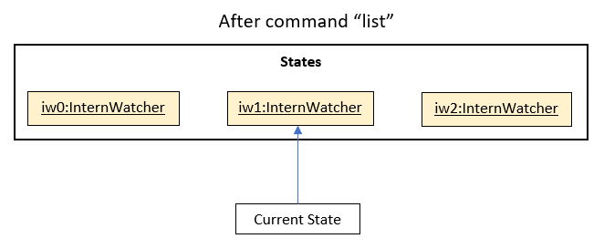

Step 6. The user executes `clear`, which calls `Model#commitInternWatcher()`. Since the `currStatePointer` is not pointing at the end of the `watcherStateList`, all Intern Watcher states after the `currStatePointer` will be purged. Reason: It no longer makes sense to redo the `add n/David …​` command. This is the behaviour that most modern desktop applications follow.

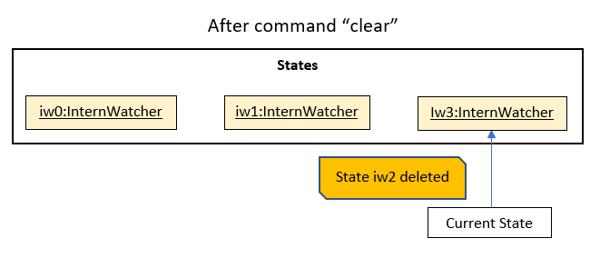

The following activity diagram summarizes what happens when a user executes a new command:

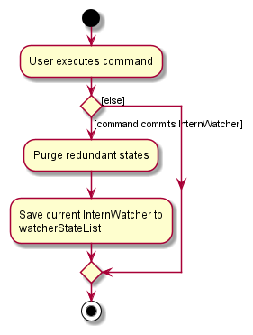

#### Design considerations:

**Aspect: How undo & redo executes:**

* **Alternative 1 (current choice):** Saves the entire applicant list.
  * Pros: Easy to implement.
  * Cons: May have performance issues in terms of memory usage.

* **Alternative 2:** Individual command knows how to undo/redo by
  itself.
  * Pros: Will use less memory (e.g. for `delete`, just save the applicant being deleted).
  * Cons: We must ensure that the implementation of each individual command are correct.

**Aspect: How to store saved states:**

* **Alternative 1:** Use two stack data structures, one for Command history and one for Undo history.
    * Pros: Using a stack is intuitive for undo/redo as the current state is simply the top of the Command History stack. When undo is executed, the top of the stack can be popped and added into the Undo History stack.
    * Cons: We must implement and manage two stacks for the functionality.

* **Alternative 2 (current choice):** Use array list data structure with a pointer.
    * Pros: Easy to implement. Only requires one data structure for both undo and redo.
    * Cons: The array list must be constantly updated and purged when a new undoable command is executed.

--------------------------------------------------------------------------------------------------------------------

## **Documentation, logging, testing, configuration, dev-ops**

* [Documentation guide](Documentation.md)
* [Testing guide](Testing.md)
* [Logging guide](Logging.md)
* [Configuration guide](Configuration.md)
* [DevOps guide](DevOps.md)

--------------------------------------------------------------------------------------------------------------------

## **Appendix: Requirements**

### Product scope

**Target user profile**:

* has a need to manage a significant number of internship applications from campus recruitment
* prefer desktop apps over other types
* can type fast
* prefers typing to mouse interactions
* is reasonably comfortable using CLI apps

**Value proposition**: Manage applications faster and more efficiently with the functions the app provides

### User stories

Priorities: High (must have) - `* * *`, Medium (nice to have) - `* *`, Low (unlikely to have) - `*`

| Priority | As a …​    | I want to …​                                     | So that I can…​                                                        |
| -------- | ------------- | --------------------------------------------------- | ---------------------------------------------------------------------- |
| `* * `   | new user      | see usage instructions                              | refer to instructions when I forget how to use the App                 |
| `* * *`  | user          | add a new applicant                                 |                                                                        |
| `* * *`  | user          | delete an applicant                                 | remove entries that I no longer need                                   |
| `* * `   | user          | delete all shown applicants                         | delete all entries that I no longer need                               |
| `* * *`  | user          | update applicant details                            | change entries accordingly                                             |
| `* * `   | user          | update all filtered applicants' details             | change all entries accordingly                                         |
| `* * *`  | user          | view an organised list of applicants                | see suitable applicants at a glance                                    |
| `* * `   | user          | undo or redo my last action                         | rectify a mistake I made                                               |
| `* * *`  | user          | save applicant profiles to a file                   | refer to them later                                                    |
| `* * *`  | user          | read applicant profiles from a file                 | refer to them                                                          |
| `* * *`  | user          | mass filter applicants against certain criteria     | find suitable applicants fitted for the job                            |
| `* * `   | user          | find applicants by their names                      | review and edit them accordingly                                       |

### Use cases

(For all use cases below, the **System** is the `InternWatcher` and the **Actor** is the `user`, unless specified otherwise)

**Use case: Add an applicant application**

**MSS**

1.  User requests to list applicants
2.  InternWatcher shows a list of applicants
3.  User requests to add a specific applicant in the list
4.  InternWatcher adds the applicant

    Use case ends.

**Extensions**

* 3a. The given details are invalid.

    * 3a1. InternWatcher shows an error message.

      Use case resumes at step 2.

**Use case: Delete an applicant application**

**MSS**

1.  User requests to list applicants
2.  InternWatcher shows a list of applicants
3.  User requests to delete a specific applicant in the list
4.  InternWatcher deletes the applicant

    Use case ends.

**Extensions**

* 2a. The list is empty.

  Use case ends.

* 3a. The given index is invalid.

    * 3a1. InternWatcher shows an error message.

      Use case resumes at step 2.

**Use case: Update an applicant application**

**MSS**

1.  User requests to list applicants
2.  InternWatcher shows a list of applicants
3.  User requests to update a specific applicant in the list
4.  InternWatcher updates the applicant

    Use case ends.

**Extensions**

* 3a. The given index is invalid.

    * 3a1. InternWatcher shows an error message.

      Use case resumes at step 2.
* 3b. The given details are invalid.
    * 3b1. InternWatcher shows an error message.

      Use case resumes at step 2.

**Use case: Update all applicants application**

**MSS**

1.  User filters applicants to update
2.  InternWatcher shows a list of applicants
3.  User requests to update all applicants in the list
4.  InternWatcher updates all displayed applicants

    Use case ends.

**Extensions**

* 3a. The given details are invalid.
    * 3b1. InternWatcher shows an error message.

      Use case resumes at step 2.

**Use case: Undo the last command**

**MSS**

1.  User requests to undo their last command to the applicant.
2.  InternWatcher reverts to the previous state before the last command.

    Use case ends.

**Extensions**

* 1a. There are no previous states to revert to.
    * 1a1. InternWatcher shows an error message.

      Use case resumes at step 1.

**Use case: Filter all applicant applications**

**MSS**

1.  User requests to list applicants
2.  InternWatcher shows a list of applicants
3.  User requests to filter the list based on specifications entered
4.  InternWatcher shows a list of applicants that fit the specifications

    Use case ends.

**Extensions**

* 3a. Any given filters are invalid.

    * 3a1. InternWatcher shows an error message.

      Use case resumes at step 2.

### Non-Functional Requirements

1.  Should work on any _mainstream OS_ as long as it has Java `11` or above installed.
2.  Should be able to hold up to 1000 applicants without a noticeable sluggishness in performance for typical usage.
3.  A user with above average typing speed for regular English text (i.e. not code, not system admin commands) should be able to accomplish most of the tasks faster using commands than using the mouse.
4.  Project should deliver new updates every two weeks
5.  Data should be saved upon exit into a JSON format file
6.  Data should be read from a JSON at a fixed file location
7.  The final product should not have to use a mouse
8.  The final product should be contained in a single window
9.  The system should provide sufficient hints to be usable by a novice.

### Glossary

* **Mainstream OS**: Windows, Linux, Unix, OS-X

--------------------------------------------------------------------------------------------------------------------

## **Appendix: Instructions for manual testing**

Given below are instructions to test the app manually.

:information_source: **Note:** These instructions only provide a starting point for testers to work on;
testers are expected to do more *exploratory* testing.

### Launch and shutdown

1. Initial launch

   1. Download the jar file and copy into an empty folder

   1. Double-click the jar file Expected: Shows the GUI with a set of sample contacts. The window size may not be optimum.

1. Saving window preferences

   1. Resize the window to an optimum size. Move the window to a different location. Close the window.

   1. Re-launch the app by double-clicking the jar file. 
       Expected: The most recent window size and location is retained.

### Editing an applicant

1. Editing an applicant while all applicants are shown

   1. Prerequisites: List all applicants using the `list` command. Multiple applicants in the list.

   1. Test case: `edit 1 a/ INTERVIEWED` 
      Expected: First applicant of the list modified to have the `INTERVIEWED` application status. Details of the edited applicant shown in the status message. Timestamp in the status bar is updated.

   1. Test case: `edit 0 a/ INTERVIEWED` 
      Expected: No applicant is edited. Error details shown in the status message. Status bar remains the same.

   1. Other incorrect edit commands to try: `edit`, `edit x`, `...` (where x is larger than the list size) 
      Expected: Similar to previous.

   1. Test case: `edit ALL a/ INTERVIEWED` 
      Expected: All currently displayed applicants modified with the `INTERVIEWED` application status. Number of applicants successfully edited shown in the status message. Timestamp in the status bar is updated.

   1. Test case: `edit ALL p/ 123` 
      Expected: No applicant is edited. Error details shown in the status message. Status bar remains the same.

   

### Deleting an applicant

1. Deleting an applicant while all applicants are being shown

   1. Prerequisites: List all applicants using the `list` command. Multiple applicants in the list.

   1. Test case: `delete 1` 
      Expected: First applicant is deleted from the list. Details of the deleted applicant shown in the status message. Timestamp in the status bar is updated.

   1. Test case: `delete 0` 
      Expected: No applicant is deleted. Error details shown in the status message. Status bar remains the same.

   1. Other incorrect delete commands to try: `delete`, `delete x`, `...` (where x is larger than the list size) 
      Expected: Similar to previous.
   
   1. Test case: `delete ALL` 
      Expected: All currently displayed applicants are deleted. Number of applicants successfully deleted shown in the status message. Timestamp in the status bar is updated.

### Viewing an applicant's details
1. Viewing an applicant's details while all applicants are being shown
   1. Prerequisites: List all applicants using the `list` command. Multiple applicants in the list.
   2. Test case: `view 1` 
      Expected: First applicant's details are displayed. Details of the applicant is shown in the status message. Timestamp in the status bar is updated.
   3. Test case: `view 0` 
      Expected: No applicant detail displayed. Error details shown in the status message. Status bar remains the same.
   4. Other incorrect view commands to try: `view`, `view x`. `...`(where x is larger than the list or a non-positive number) 
      Expected: Similar to previous.

### Saving data

1. Dealing with missing/corrupted data files

   1. Save file is missing: A new save file `internwatcher.json` will be created on `exit` the next time Intern Watcher is used.
   2. Save file is corrupted: If invalid data is present, such as a person with phone number `abcd`, Intern Watcher will start with
   an empty applicant list instead.
   3. Save file applicant has duplicate fields: If an applicant has duplicate fields, such as two `phone` key value pairs, Intern Watcher
   will parse the applicant with the last `phone` value.
