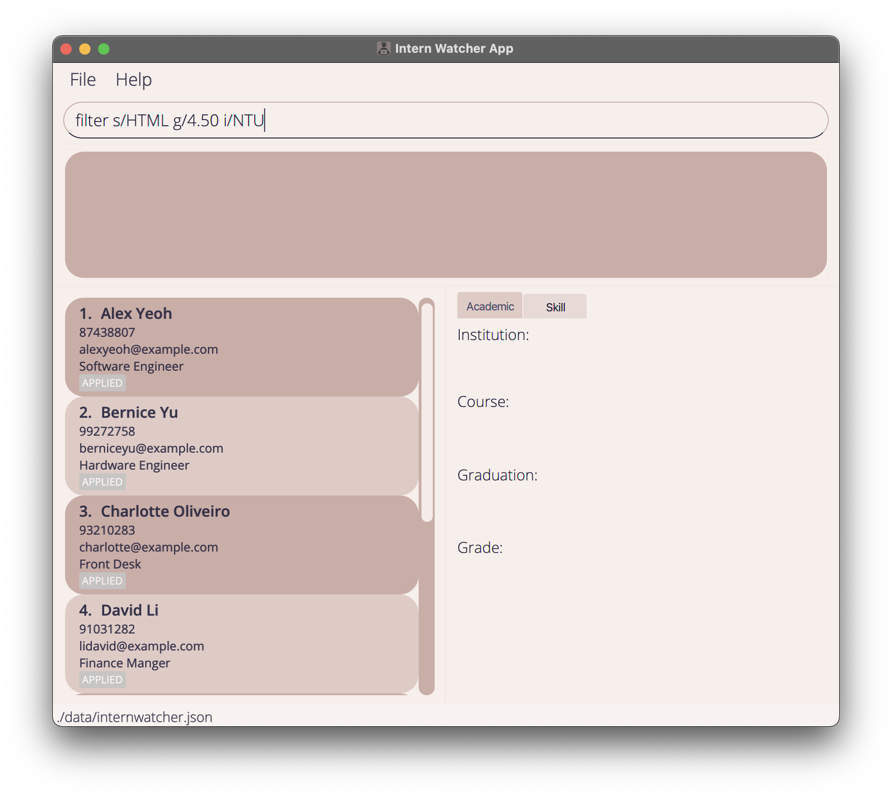
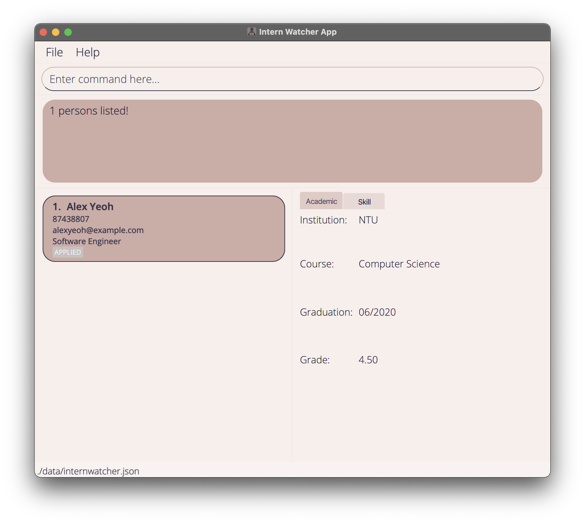
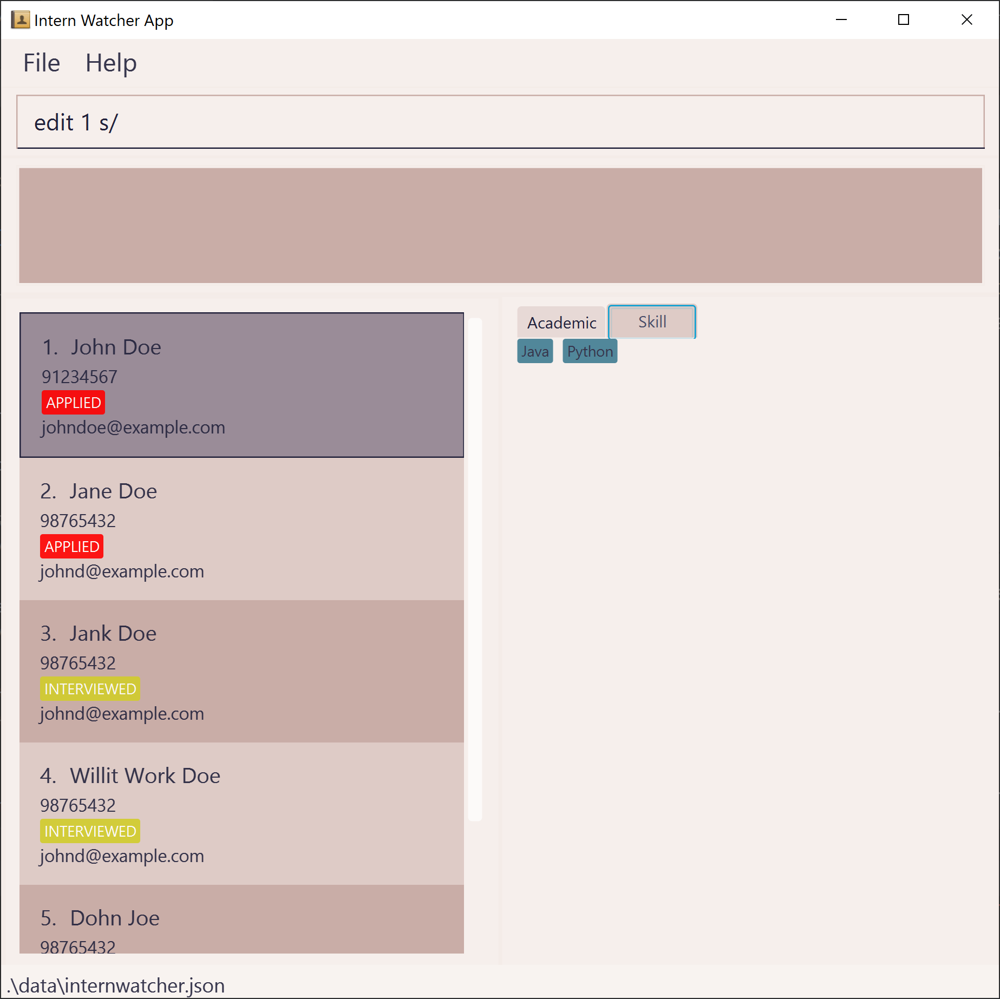
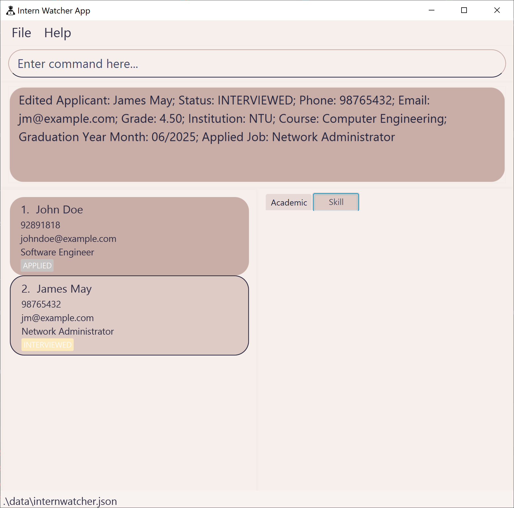
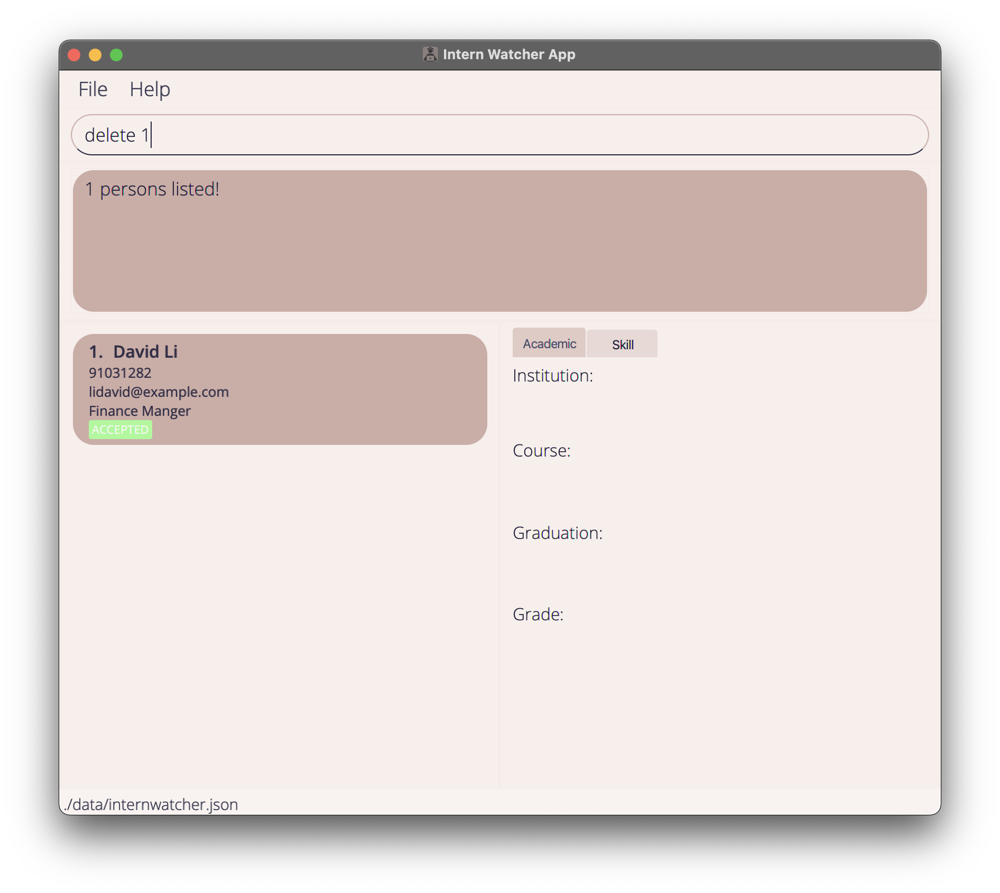
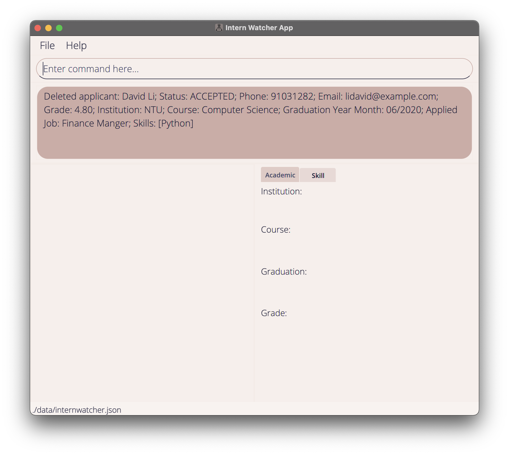
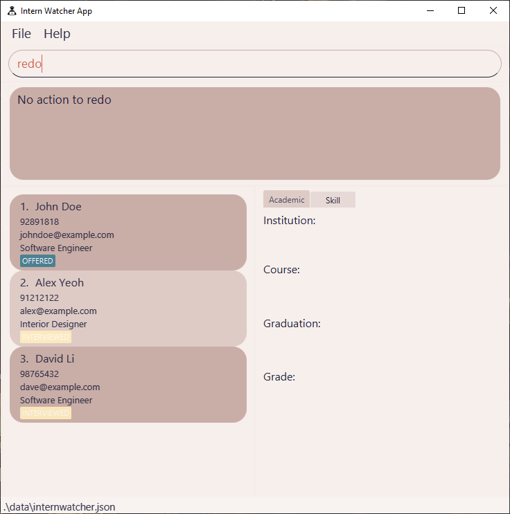

Intern Watcher (IW) is a **desktop app for Human Resource Managers to manage internship applicants, optimized for use via a Command Line Interface** (CLI) while still having the benefits of a Graphical User Interface (GUI). If you can type fast, IW can get your applicant management tasks done faster than traditional GUI apps.

You can use Intern Watcher to add, edit and delete the internship applicants. Intern Watcher also allows you to track applicants' details such as grades and skills, as well as filter applicants by their details.

This user guide covers a quick walk-through on how to use this application, as well as the full descriptions of the features available.
* Table of Contents
{:toc}

--------------------------------------------------------------------------------------------------------------------

## Quick start

1. Ensure you have Java `11` or above installed in your computer. You can download it [here](https://www.oracle.com/java/technologies/downloads/#java11).

2. Download the latest `internwatcher.jar` from [here](https://github.com/AY2122S1-CS2103T-F12-2/tp/releases).

3. Copy the file to the folder you want to use as the _home folder_ for your Intern Watcher.

4. Double-click the file to start the app. The GUI similar to the below should appear in a few seconds. Note how the app contains some sample data. 
    
   
5. Type any command in the command box and press the "Enter" key to execute it. e.g. typing **`help`** and pressing Enter will open the help window. 

6. Some example commands you can try:

   * `list` : Lists all applicants.

   * `add n/John p/123 e/a@a.com g/4.50 i/NTU c/Computer Science y/06/2025 j/Software Engineer a/INTERVIEWED` : Adds an applicant named `John` with the above details to Intern Watcher.

   * `find john` : Lists all applicants whose name contains john.

   * `filter g/4.50 c/Computer Science` : Lists all applicants who have a grade greater or equal to 4.50 and who are studying the Computer Science course.

   * `delete 3` : Deletes the 3rd applicant shown in the current list.

   * `view 3 T` : Displays the skills of the 3rd applicant shown in the current list.

   * `undo` : Undo the last command that you entered.

   * `redo` : Reverse the last undo command.

   * `clear` : Deletes all applicants from the application.

7. To see more detailed information about each command, refer to [Features](#features).

8. To see restrictions and specifications of each field, refer to [Specification of Fields.](#specification-of-fields).

--------------------------------------------------------------------------------------------------------------------

## Features

**:information_source: Notes about the command formats:** 

* Words in `UPPER_CASE` are the field parameters to be supplied by you. 
  This excludes special tags for **Edit**, **View**, **Delete** commands.  
  * e.g. in `add n/NAME`, `NAME` is a field parameter to be replaced. You can enter `add n/John Doe`. 
  * e.g. in `delete ALL`, `ALL` is to be typed the same in full capital letters.

* Fields in square brackets are optional. 
  * e.g in `n/NAME [s/SKILL]`, the `SKILL` parameter is optional. You can enter `n/John Doe s/Python` or `n/John Doe`.

* Fields with `…+` notation behind them can be specified zero or more times. 
  * e.g. `[s/SKILL]…+` can be specified as ` ` (i.e. 0 times), `s/Java`, `s/Python s/C` etc.

* Fields can be specified in any order. 
  * e.g. if the command format specifies `n/NAME p/PHONE_NUMBER`, `p/PHONE_NUMBER n/NAME` is also valid.

* If a command expects only one instance of a field parameter, but the parameter has been specified multiple times, only the last occurrence of the parameter will be taken regardless if the previous specified parameter is valid or not. 

  * e.g. if you specify `p/abcdefg p/56785678`, only `p/56785678` will be taken.

* Extra parameters for commands that do not take in parameters (such as `help`, `list`, `exit` and `clear`) will be ignored. 
  * e.g. if the command is specified as `help 123`, it will be interpreted as `help`.

### Viewing help : `help`

Displays a message explaining how to access the help page.

Format: `help`

### Adding an applicant: `add`

Adds a new applicant to Intern Watcher.

Format: `add n/NAME p/PHONE e/EMAIL g/GRADE i/INSTITUTION c/COURSE y/GRADUATION_YEAR_MONTH j/JOB [a/APPLICATION_STATUS] [s/SKILL]…+`

* Entries with same `NAME` (case-insensitive) will not be allowed. For example, `John Doe` and `john doe` are considered the same applicant and the second entry will not be allowed.
* `APPLICATION_STATUS` and `SKILL` are case-sensitive.

:bulb: **Tip:**
An applicant can have any number of skills (including 0)

Examples:

* `add n/Jonathan Tan p/86565432 e/jonathan_tan@example.com g/4.50 i/NTU c/Computer Science y/06/2025 j/Software Engineer a/SCHEDULED s/Java s/C s/Python` adds
 an applicant with the specified information.
  

### Listing all applicants : `list`

Displays the list of all applicants in Intern Watcher.

Format: `list`

### Viewing an applicant's details : `view`

Displays the specified applicant's academic records, or skills.

Format: `view INDEX [T]`

* If only `INDEX` is specified, it will show the specified applicant's academic records by default.
  * `INDEX` refers to the index number of the applicant, shown in the applicant list.
  * `INDEX` **must be a positive integer**, e.g. 1, 2, 3, …
  * `INDEX` of 0 or less, or indexes greater than `2147483647` will be treated as invalid commands.
* Specifying `T` together with `INDEX` switches between the academic records tab and the skills tab.

Examples:
* `list` followed by `view 1`. Shows the 1st applicant's academic records.

|Command|Effect|
|---|---|
|||

* `view 2 T` Shows the 2nd applicant's skills, if academic records was previously selected.

|Command|Effect|
|---|---|
|||

### Filtering by Fields : `filter`

Displays applicants in Intern Watcher that match one or more given fields.

Format: `filter [g/GRADE] [i/INSTITUTION]…+ [c/COURSE]…+ [y/GRADUATION_YEAR_MONTH] [j/JOB]…+ [a/APPLICATION_STATUS]…+ [s/SKILL]…+`

* `filter` will show applicants that match all fields specified.
* `[i/INSTITUTION]…+`, `[c/COURSE]…+` and `[j/JOB]…+` are case-insensitive and `[a/APPLICATION_STATUS]…+` and `[s/SKILL]…+` are case-sensitive.
* If `[g/GRADE]` is specified, it will show all applicants with grades higher or equal to the `g/Grade` specified.
* Likewise, if `[y/GRADUATION_YEAR_MONTH]` is specified, it will show all applicants with graduation dates that is strictly before the `GRADUATION_YEAR_MONTH` specified.
* If `[s/SKILL]…+` is specified, only applicants with all specified `[s/SKILL]…+` will be shown.
* For either of `[c/COURSE]…+` or `[j/JOB]…+`, if more than 1 instance of a single field, such as `[j/JOB]…+` is specified, applicants with their job field **containing** at least one of the `[j/JOB]…+` specified will be shown.
* For either of `[i/INSTITUTION]…+` or `[a/APPLICATION_STATUS]…+`, if more than 1 instance of a single field, such as `[i/INSTITUTION]…+` is specified, applicants with their field **matching** at least one of the `[i/INSTITUTION]…+` specified will be shown.

Examples:
* `filter s/Python s/Java` will show only applicants with skills in both JAVA and PYTHON.

|Command|Effect|
|---|---|
|||

* `filter s/HTML g/4.50 i/NTU` will show applicants whose grade is not less than 4.50, knows HTML and is from NTU.

|Command|Effect|
|---|---|
|||

### Editing applicants : `edit`

Edits the information of an existing applicant, or the application status of all currently displayed applicants in the applicant list.

#### Editing a specific applicant:
Format: `edit INDEX [n/NAME] [p/PHONE] [e/EMAIL] [g/GRADE] [i/INSTITUTION] [c/COURSE] [y/GRADUATION_YEAR_MONTH] [j/JOB] [a/APPLICATION_STATUS] [s/SKILL]…+`
* If only `INDEX` is specified, the applicant at the specified `INDEX` will be edited.
    * `INDEX` refers to the index number shown in the displayed applicant list. 
    * `INDEX` **must be a positive integer** e.g. 1, 2, 3, …
    * `INDEX` of 0 or less, or indexes greater than `2147483647` will be treated as invalid commands.
* When editing skills, all existing skills of the applicant will be replaced i.e adding of skills is not cumulative.
* You can remove all the applicant’s skills by typing `s/` without
  specifying any skills after it.

#### Editing all currently displayed applicants:
Format: `edit ALL a/APPLICATION_STATUS`
* If `ALL` is specified, all applicants currently displayed in the applicant list will be edited.
* Currently only the `APPLICATION_STATUS` of applicants can be edited. It is unlikely that the other fields would need multi editing.
* The `APPLICATION_STATUS` can only be one of these 7 statuses: `ACCEPTED`, `REJECTED`, `INTERVIEWED`, `APPLIED`, `SCHEDULED`, `RECEIVED` and `OFFERED`.

Examples:
*  `edit 1 p/89274567 e/alex_yeoh@example.com` edits the phone number and email address of the 1st applicant to be `89274567` and `alex_yeoh@example.com` respectively.

|Command|Effect|
|---|---|
|||

*  `edit 1 s/` clears all existing skills of the 1st applicant.

|Command|Effect|
|---|---|
|||

*  `filter a/APPLIED` followed by `edit ALL a/INTERVIEWED` updates all applicants with `APPLIED` application status to have the `INTERVIEWED` application status.

|Command|Effect|
|---|---|
|||

### Deleting an applicant : `delete`

Deletes the specified applicant, or all applicants currently displayed in the applicant list.

#### Deleting a specific applicant:
Format: `delete INDEX`

* If `INDEX` is specified, the applicant at the specified `INDEX` will be deleted.
    * `INDEX` refers to the index number shown in the displayed applicant list. 
    * `INDEX` **must be a positive integer** e.g. 1, 2, 3, …
    * `INDEX` of 0 or less, or indexes greater than `2147483647` will be treated as invalid commands.

#### Deleting all currently displayed applicants:
Format: `delete ALL`

* If `ALL` is specified, all applicants currently displayed in the applicant list will be deleted.

Examples:
* `list` followed by `delete 2` deletes the 2nd applicant in Intern Watcher.

|Command|Effect|
|---|---|
|||

* `list` followed by `delete ALL` deletes all applicants in Intern Watcher. Effect is similar to `clear` when used in conjunction with `list`.

|Command|Effect|
|---|---|
|||

* `find David` followed by `delete 1` deletes the 1st applicant in the results of the `find` command.

|Command|Effect|
|---|---|
|||

### Locating applicants by name: `find`

Displays applicants whose names contain at least one of the given keywords.

Format: `find KEYWORD [MORE_KEYWORDS]`

* The search is case-insensitive. e.g `hans` will match `Hans`.
* The order of the keywords does not matter. e.g. `Hans Bo` will match `Bo Hans`.
* Only the NAME field of the applicants are searched.
* Only full words will be matched e.g. `Han` will not match `Hans`.
* Applicants matching at least one keyword will be returned.
  * e.g. `Hans Bo` will return `Hans Gruber`, `Bo Yang`

Examples:
* `find John` returns `john` and `John Doe`
* `find alex david` returns `Alex Yeoh`, `David Li` 
  

### Clearing all entries : `clear`

Clears all applicant entries from Intern Watcher.

Format: `clear`

### Undoing an action : `undo`

Undo a previous command action.

Format: `undo`

* Only undoable command actions can be undone.
    * Undoable command actions include: `add`, `edit`, `delete`, `clear`, `redo`.
* Consecutive `undo` commands are available until the applicant list returns to its **initial state at launch** of the application.
* If the current state of the applicant list is the initial state, the `undo` command will not be available.
* The applicant detail panel state will not be preserved. For instance, after `view 1` and `delete 1`, `undo` will restore the deleted applicant to the applicant list, but the applicant detail panel will not be reverted to show the details of the deleted applicant.

Examples:
* `undo` (after `delete 2`). The applicant that was removed will be restored in Intern Watcher.

|Command|Effect|
|---|---|
|||

* `undo` (after initial start up of Intern Watcher). As there are no previous states to restore, no undo action will be performed.

### Redoing an action: `redo`

Reverses a previous undo command action.

Format: `redo`

* `redo` is the reverse of `undo`. Only undoable command actions can be redone.
  * Undoable actions include: `add`, `edit`, `delete`, `clear`, `redo`.
* Consecutive `redo` commands are available until the applicant list reaches the **newest state**.
  *  The newest state is the most recent change in history.
* If the current state of the applicant list is the newest state, the redo command will not be available.
* If a new undoable action is performed when the applicant list is **not** in its newest state, the current state becomes the newest state.

Examples:
* `clear` followed by `undo` followed by `redo`. The clear command will be redone.

|Command|Effect|
|---|---|
|||

* `delete 2` followed by `redo`. As the state after `delete` becomes the newest state, there are no undoable actions to be redone.
  

### Exiting the program : `exit`

Exits the program.

Format: `exit`

### Saving the data

Intern Watcher data are saved in the hard disk automatically after any command that changes the data. There is no need to save manually.

### Editing the data file

Intern Watcher saves data as a JSON file `[JAR file location]/data/internwatcher.json`. Advanced users are welcome to update data directly by editing that data file.

:exclamation: **Caution:**
If your changes to the data file makes its format invalid, Intern Watcher will discard all data and start with an empty data file at the next run.

--------------------------------------------------------------------------------------------------------------------
### Specification of Fields

`Name` : The applicant's name. Should only include alphanumeric characters and spaces only. Should not be blank.

`Phone` : The applicant's phone number. Should only contain digits from 0 to 9, with a minimum length of 3 digits.

`Email` : The applicant's email address. Should be in the form of *Local-part*@**Domain**. *Local-part* should contain only alphanumeric characters with only these special characters `+_.-`.
**Domain** can be separated into ***label*** with `.` if necessary. Each ***label*** should only contain alphanumeric characters and separated and is separated by `-` if necessary. Domain is at least 2 characters long and needs to start and end with alphanumeric characters.

`Grade` : The applicant's Grade Point Average (GPA). Should be a number in 2 decimal places from 0.00 - 5.00.

`Institution` : The applicant's school. Should only include alphanumeric characters and space only. Should not be blank.

`Application_Status` : The applicant's application status. Case sensitive. Should only be one of these 7 statuses, `ACCEPTED` , `REJECTED`, `INTERVIEWED`, `APPLIED` , `SCHEDULED`, `RECEIVED` and `OFFERED`.

`Course` : The applicant's course of study in their school. Should only include alphabet characters and space only. Should not be blank.

`Graduation_Year_Month` : The applicant's estimated date of graduation from their school. Should be of format MM/yyyy and be after the date 01/2020.

`Job` : The job/position that the applicant applied for. Should only include alphabet characters and space only. Should not be blank.

`Skill`: The applicant's skillset. Should only include alphanumeric characters, spaces and `+#` symbols only.

--------------------------------------------------------------------------------------------------------------------

## FAQ

**Q**: How do I transfer my data to another computer? 
**A**: Install the app in the other computer and overwrite the empty data file it creates with the file that contains the data of your previous InternWatcher home folder.

**Q**: The command result shows `Could not save data to file: data\internwatcher.json. File access denied, ensure save file is not set to read only.`, how do I fix this? 
**A**: The `internwatcher.json` save file in your `\data` directory has been set to read only. Open the `data` file, right click on `internwatcher.json`, click properties, and make sure read-only is unchecked. Apply changes if necessary.

--------------------------------------------------------------------------------------------------------------------

## Command summary

Action | Format, Examples
--------|------------------
**Help** | `help`
**Add** | `add n/NAME p/PHONE e/EMAIL g/GRADE i/INSTITUTION c/COURSE y/GRADUATION_YEAR_MONTH j/JOB [a/APPLICATION_STATUS] [s/SKILL]…+`   e.g. `add n/John p/999 e/a@a.com g/4.00 i/NTU c/CS y/06/2025 j/Software Engineer a/INTERVIEWED s/Python`
**List** | `list`
**View** | `view INDEX [T]`   e.g. `view 2 T`
**Filter** | `filter [g/GRADE] [i/INSTITUTION]…+ [c/COURSE]…+ [y/GRADUATION_YEAR_MONTH] [j/JOB]…+ [a/APPLICATION_STATUS]…+ [s/SKILL]…+`   e.g. `filter s/JAVA y/06/2022 i/NUS a/REJECTED`
**Edit** | `edit ALL a/APPLICATION_STATUS` ,  `edit INDEX [n/NAME] [p/PHONE] [e/EMAIL] [g/GRADE] [i/INSTITUTION] [c/COURSE] [y/GRADUATION_YEAR_MONTH] [j/JOB] [a/APPLICATION_STATUS] [s/SKILL]…+` e.g. `edit ALL a/REJECTED` ,   `edit 2 n/James Lee e/jameslee@example.com`
**Delete** | `delete INDEX`,   `delete ALL`  e.g. `delete 3`,   `delete ALL`
**Find** | `find KEYWORD [MORE_KEYWORDS]`  e.g. `find James Jake`
**Undo** | `undo`
**Redo** | `redo`
**Clear** | `clear`
**Exit** | `exit`
